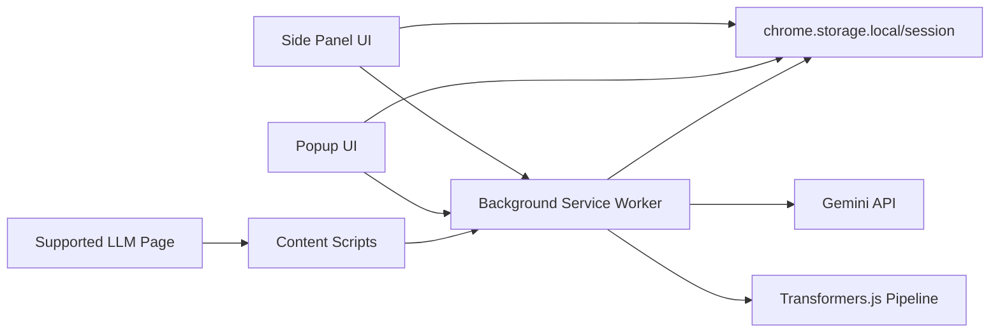

# Promptium Architecture

## High-Level System Diagram Description



## Separation of Concerns

- `content/`
  - Host-page integration (FAB, prompt capture, message range selection)
  - Prompt injection into active chat editors
  - Scraping and normalizing chat messages
- `background/`
  - AI orchestration and runtime messaging
  - Embedding model lifecycle and semantic search operations
  - Secure Gemini request handling outside page context
- `popup/`
  - Lightweight quick-access interface
  - Onboarding and rapid prompt/history interactions
- `sidepanel/`
  - Full workspace for prompts, tags, export, settings, and improvement flows
- `utils/`
  - Shared storage, export, constants, DOM, and AI bridge abstractions

## State Management Approach

Promptium uses pragmatic module-level state within each execution context:
- Side panel maintains in-memory `state` for active tab, settings draft, export preferences, and selection snapshots.
- Background service worker maintains transient AI pipeline state and embedding cache, with persistence to storage for recovery.
- Content scripts maintain per-tab selection and observer state.

No global framework store is used; each context owns local state and exchanges data through explicit message contracts.

## Storage Layer (`chrome.storage`)

- `chrome.storage.local`
  - Prompt library (`prompts`)
  - Chat history (`chatHistory`)
  - Settings (`promptiumSettings`)
  - Gemini key (`promptiumGeminiKey`)
  - Pending improve payload (`promptiumImprovePayload`)
- `chrome.storage.session`
  - Ephemeral side panel export payload handoff (`promptiumSidePanelPayload`)

## Embedding Generation Flow

1. Service worker initializes Transformers.js feature-extraction pipeline.
2. Prompt text is converted to normalized embedding vectors.
3. Embeddings are cached in memory and persisted to storage.
4. Cache updates occur on prompt add/remove operations.

## Search Pipeline

1. User enters a search query.
2. Keyword results are generated immediately for responsiveness.
3. If semantic mode is enabled and ready, query embedding is generated.
4. Cosine similarity ranks prompt embeddings.
5. UI merges semantic ranking with keyword matches and renders results.

## Prompt Improvement Pipeline

1. UI sends improvement request (`text`, `tags`, `style`) via AI bridge.
2. Service worker validates input and Gemini API key.
3. Service worker requests improvement from Gemini endpoint.
4. Result returns to side panel diff modal.
5. User chooses save, replace, or inject action.

## Export Engine Pipeline

1. Content script gathers selected chat message ranges.
2. Payload is staged to session/local transport key.
3. Side panel loads payload and renders format-aware preview.
4. Exporter module transforms content into target format.
5. Blob download is triggered with generated Promptium filename.

## Error Handling Architecture

Promptium applies actionable, user-facing error handling:
- Missing API key: explicit UI state + "Go to Settings" action
- Embedding/model failures: retry action in settings workspace
- Export failures: retry + debug hint near export status
- Storage quota failures: cleanup guidance and route to removable data areas

Raw stack traces are not surfaced in UI.

## Security Considerations

- API keys are stored locally in extension storage; no external backend.
- Gemini calls are routed through service worker context.
- Content script HTML extraction strips unsafe nodes/attributes.
- Side panel payload handling validates object shape before persistence.
- Host navigation is allowlisted for supported LLM domains.

## Folder-Level Breakdown

```text
background/
  service_worker.js       # runtime messaging, AI orchestration, Gemini requests
content/
  content.js              # content runtime, selection bar, payload handoff
  toolbar.js              # in-page FAB actions
  injector.js             # prompt injection into active composer
  scraper.js              # message scraping/normalization
popup/
  popup.html/js/css       # compact management UI
  onboarding.js/css       # first-run guided onboarding
sidepanel/
  sidepanel.html/js       # full Promptium workspace
utils/
  storage.js              # CRUD + quota diagnostics
  exporter.js             # markdown/pdf/json/txt export transforms
  ai-bridge.js            # typed runtime bridge to service worker AI handlers
  dom-helpers.js          # shared UI helper primitives
  templates.js            # curated template registry
```

## Data Flow Summary

- User action starts in popup, side panel, or page FAB.
- Action routes to utility layer and/or background worker.
- Storage is updated and UI re-renders from normalized state.
- For AI flows, background mediates model/API calls and returns structured responses.
- For export flows, selected message payloads are transported through session/local storage and rendered in side panel preview before download.
